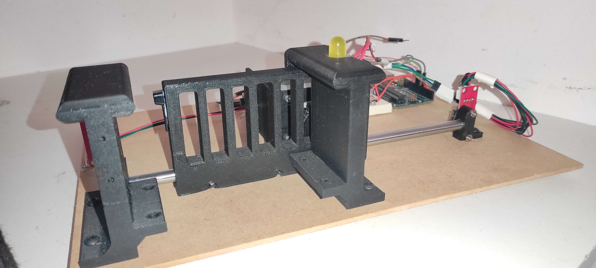

# Mechanical Design - SolidWorks

This section details the mechanical aspects of the project, focusing on the SolidWorks design. The mechanical components are organized into several folders, each containing specific models related to the gate control system.

## Directory Structure

### 1. **Endstop Models**
   - This folder contains the SolidWorks models for the endstop switches used in the gate control system. Endstops are crucial for detecting the open and closed positions of the gate.

### 2. **Motor Model**
   - The Motor Model directory holds the SolidWorks model for the stepper motor. This model represents the physical characteristics and dimensions of the motor used in the gate control mechanism.

### 3. **Gate Model**
   - Inside the Gate Model directory, you'll find the SolidWorks model for the gate assembly. This includes the gate itself, the rack and pinion mechanism (cremaillere), and the sliding components (glissiere) that enable controlled movement.

### 4. **Support Walls**
   - The Support Walls folder contains SolidWorks models representing the walls that support the gate structure. These walls are essential for providing stability and guidance to the gate during its operation.

### 5. **Assembly File**
   - The Assembly File directory contains the SolidWorks assembly file (.sldasm). This file brings together all the individual components, defining their relationships and interactions within the gate control system.

## Dependencies

- **SolidWorks:**
  - Ensure that SolidWorks is installed on your system to open and view the provided models.

## Usage

1. **Endstop Models:**
   - These models are essential for accurately placing the endstop switches in the gate assembly. Refer to these models for proper positioning and alignment.

2. **Motor Model:**
   - The motor model provides insights into the physical dimensions of the stepper motor. This information is crucial for ensuring compatibility and integration with the overall gate system.

3. **Gate Model:**
   - Explore the gate model to understand the design of the gate, including its structure, the rack and pinion system, and sliding components. This model serves as a comprehensive representation of the gate assembly.

4. **Support Walls:**
   - Understand the placement and design of support walls by referring to the models in this directory. These walls contribute to the stability and proper functioning of the gate.

5. **Assembly File:**
   - The assembly file combines all individual components into a cohesive system. Open this file in SolidWorks to visualize the complete gate control mechanism and examine how each part contributes to the overall functionality.

## Visuals

### SolidWorks Model

### Physical Prototype

Feel free to explore and modify these SolidWorks models as needed for your specific project requirements.
