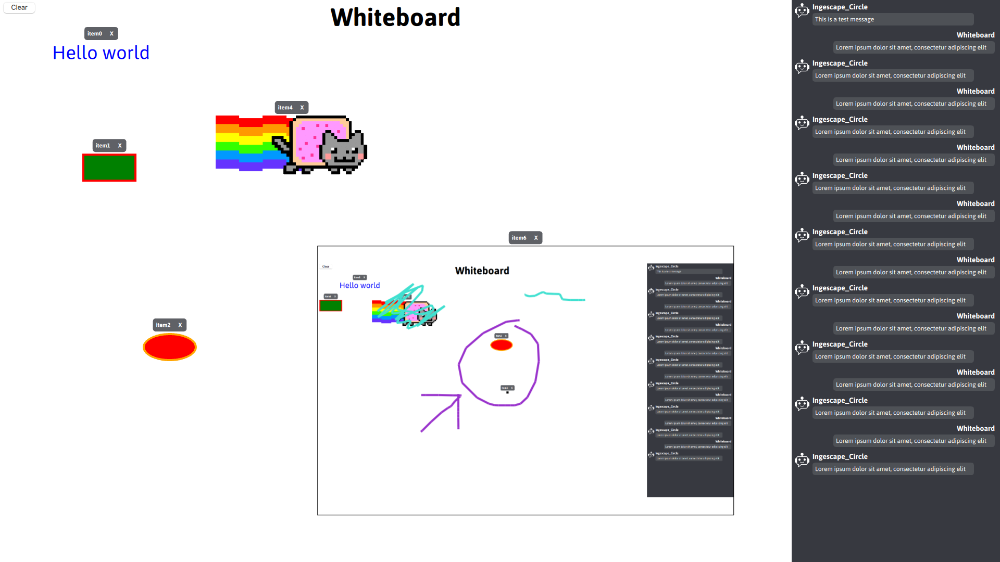
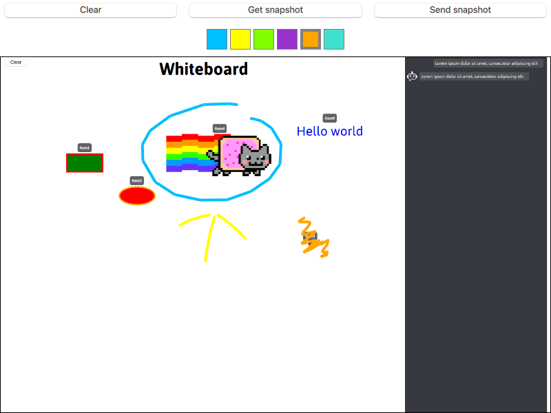
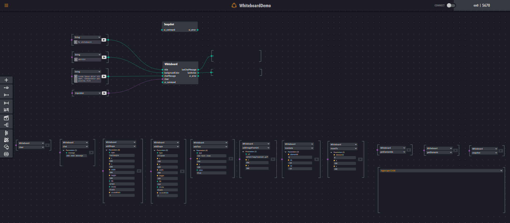
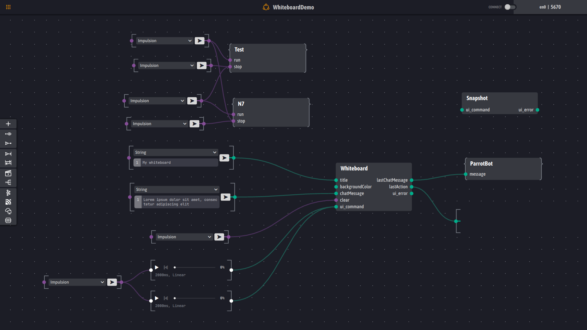

# Whiteboard demo

## Whiteboard app

A simple collaborative whiteboard:
- It provides inputs to set its title (**title**) and its background color (**backgroundColor**), to add a chat message (**chatMessage**) or clear our whiteboard (**clear**)
- It provides outputs to notify the last chat message (**lastChatMessgae**) (the goal is to use it as the input of a chatbot) and the last executed action (**lastAction**)
- It exposes services:
  - to add texts (**addText**), images (**addImage** (base64 encoded image) or **addImageFromUrl** (local or remote URL)) and basic shapes (rectangle, ellipse) (**addShape**),
  - to change properties of a given element (**setStringProperty**, **setDoubleProperty**)
     - Properties of text elements:
        - setDoubleProperty: **x**, **y**, **opacity** (between 0 and 1)
        - setStringProperty: **text**, **color** (SVG named color or #RRGGBB)
     - Properties of image elements:
        - setDoubleProperty: **x**, **y**, **width**, **height**, **opacity** (between 0 and 1)
        - setStringProperty: **source** (local or remote url)
     - Properties shape elements:
        - setDoubleProperty: **x**, **y**, **width**, **height**, **opacity** (between 0 and 1), **strokewidth**
        - setStringProperty: **fill** (SVG named color or #RRGGBB), **stroke** (SVG named color or #RRGGBB)
  - to remove a given element (**remove**)
  - to move a given element either realtively (**translate**) or absolutely (**moveTo**), 
  - to take a snapshot of our whiteboard (**snapshot**), 
  - to clear it (**clear**)
  - to add a message from a chatbot (**chatbot**)
  - to get all ids of displayed elements (**getElementIds**) (JSON array: list of ids)
  - to get all displayed elements (**getElements**) (JSON array: list of JSON objects describing each element (type, properties))

## Snapshot app

A companion app uses to display and annotate snapshots of our Whiteboard app and send them back

## Platform

[Simple platform file](./WhiteboardDemo.igsplatform)
- Writers and ServiceCallers to test the Whiteboard app

[Advanced plaform file](./WhiteboardDemo_advanced.igsplatform)
- ParrotBot: a snippet that acts as a parrot i.e. it repeats its input
- Test: a snippet that tests nearly all services of our whiteboard (except **snapshot**, **addImage** (because it requires a base64 encoded images), **getElementIds** and **getElements**) 
- N7: a snippet that displays the ENSEEIHT logo and moves it
- Flashing: a snippet that displays a text and a circle and updates their properties (text, color) to mimic a flashing light

## Verification & Validation

Whiteboard: [V&V script](./Whiteboard.igsscript)
